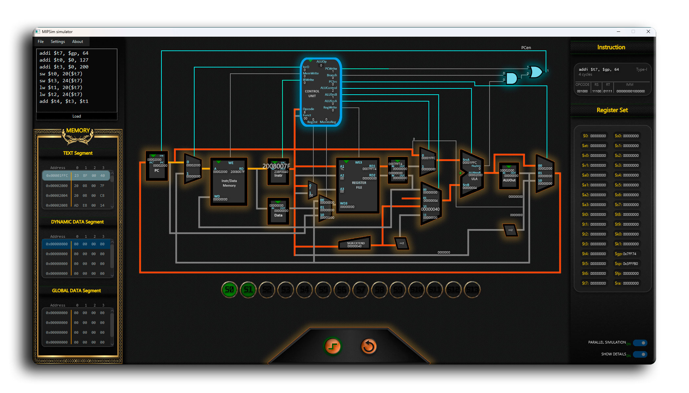
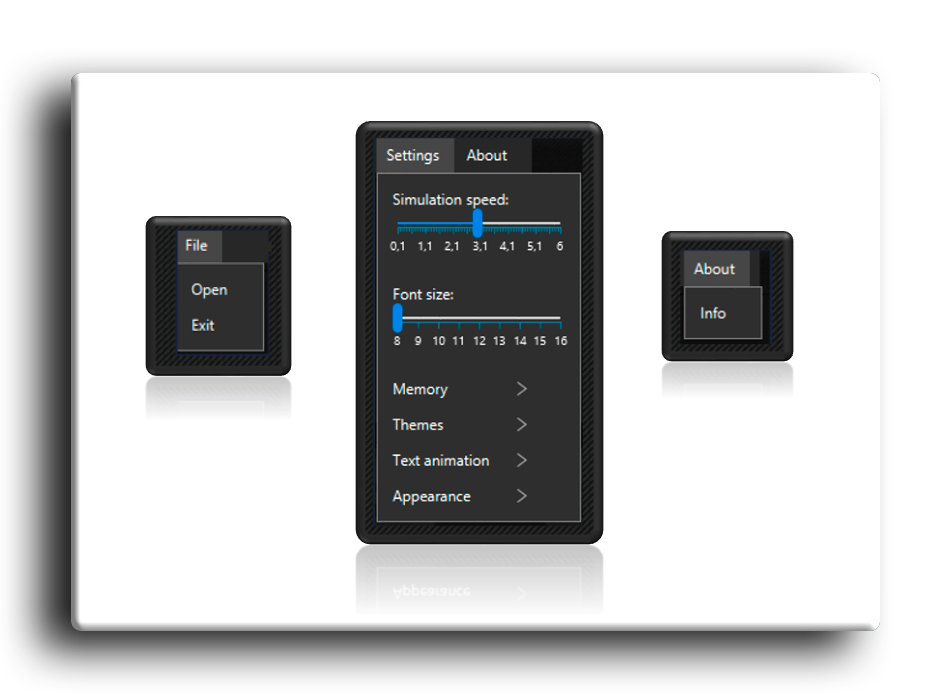
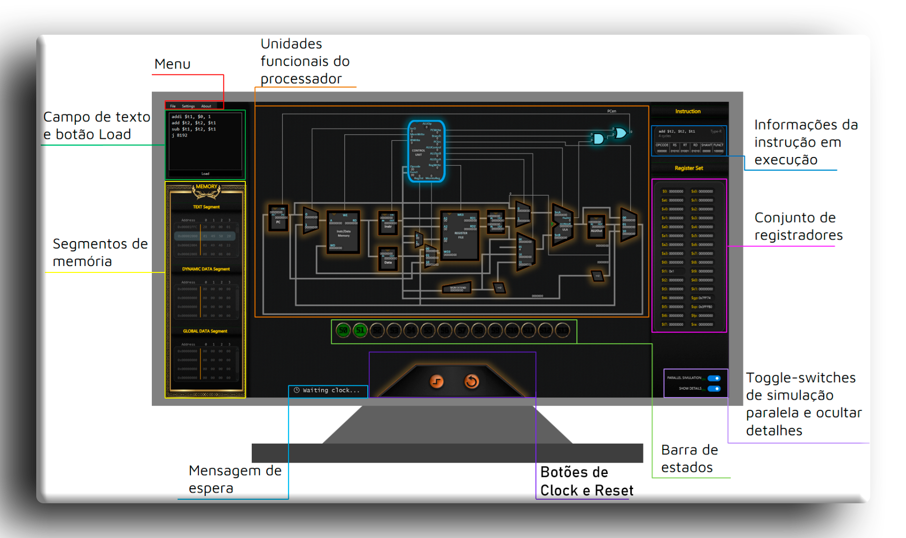
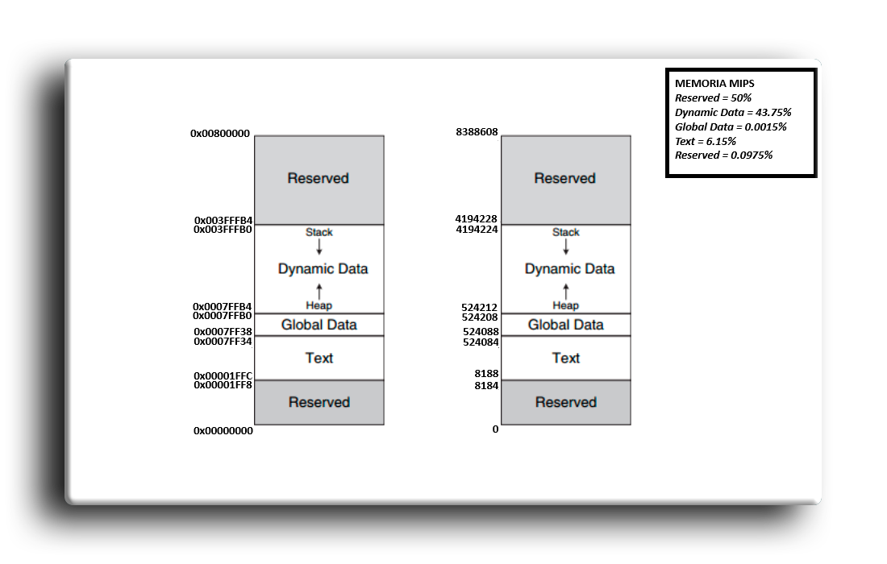
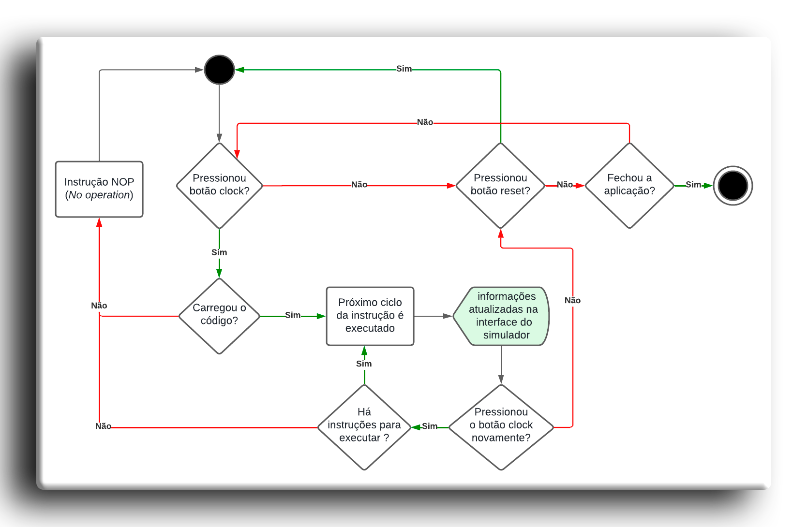

# MIPSIM v1.04
**Software Simulador da Microarquitetura MIPS de Processador Multi-ciclos**  
```
    Desenvolvido em conjunto com a monografia do Trabalho de Conclusão de Curso (TC2) 
em Ciência da Computação, da UFMT. O objetivo do software à época era fornecer uma
ferramenta que simulasse o caminho de dados do Microprocessador MIPS32, em sua 
implementação Multi-ciclos, para auxiliar o aprendizado em sala de aula em disciplinas
de Arquitetura de processadores ou correlatas.
```

## Interface do simulador





## Funcionalidades do Simulador




## Estrutura da Memória do Simulador
```
    Para o simulador MIPSim, foi proposto uma nova estrutura de memória simplificada com
8MB (8.388.608 bytes). As justificativas para isso foram elencadas na monografia, que 
disponibilizarei ao fim da página 
```




## Diagrama de Atividades do Simulador




```
Monografia disponível em: https://bdm.ufmt.br/handle/1/4246
```


